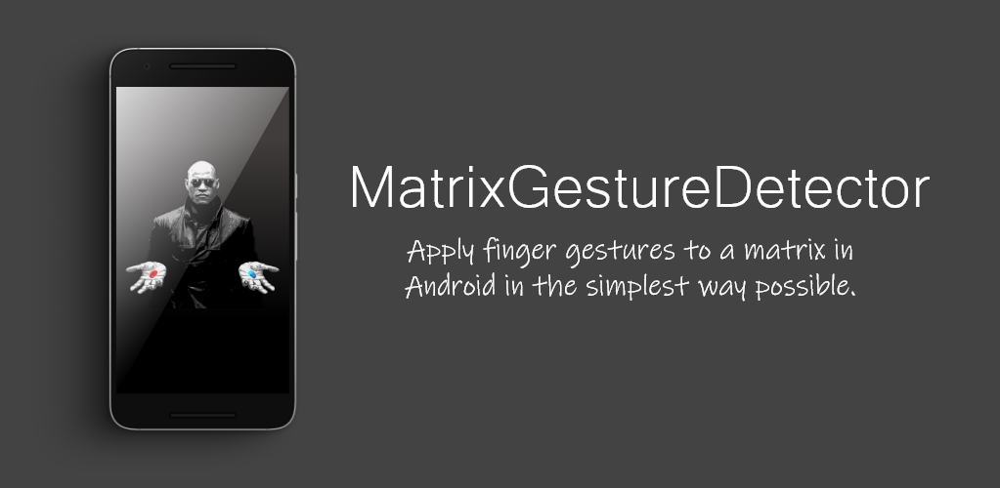

# FingerGestureTransformationsKotlin
Simple library for applying finger gestures into transformations matrix written in Kotlin

<p align="center">
    
</p>
 
## About
Kotlin Library used for detecting finger gestures and applying there coresponding transformation to a 3x3 [matrix](https://developer.android.com/reference/kotlin/android/graphics/Matrix). That way you can apply the follwing transformation: scale, translate and rotate to the matrix, then it can be used to apply the transformations to shapes such as rectangles, circles, paths, lines and bitmaps. Afther that those shapes can be drawn in to a canvas retrived by the [onDraw()](https://developer.android.com/training/custom-views/custom-drawing) method from any view.
 
[](http://developer.android.com/index.html)
[](https://android-arsenal.com/api?level=21)
[](https://github.com/slaviboy/FingerGestureTransformationsKotlin/releases/tag/v.0.1.0)

## Add to your project
Add the jitpack maven repository
```
allprojects {
  repositories {
    ...
    maven { url 'https://jitpack.io' }
  }
}
``` 
Add the dependency
```
dependencies {
  implementation 'com.github.slaviboy:FingerGestureTransformationsKotlin:v0.1.0'
}
```
 
### How to use
In your custom view add instance of the **MatrixGestureDetector** class, then call its method **onTouchEvent()** from its matching methods called in the view. And finally draw your shape, but before that applying the matrix transformations to your canvas. A full example of drawing bitmap on to a custom view, that can be rotate, scaled and translated can be found in the project [HERE](https://github.com/slaviboy/FingerGestureTransformationsKotlin/blob/master/app/src/main/java/com/slaviboy/fingergesturetransformations/GestureView.kt).
```kotlin

// create gesture detector
val matrixGestureDetector = MatrixGestureDetector(matrix)
 
// call the method onTouchEvent()
override fun onTouchEvent(event: MotionEvent): Boolean {

   // apply transformation to detector using the motion event
   matrixGestureDetector.onTouchEvent(event)

   // request redrawing of the view
   invalidate()

   return true
}

// draw your shapes here
override fun onDraw(canvas: Canvas) {
     
     // apply transformations to the canvas
     canvas.setMatrix(matrixGestureDetector.matrix)
     
     // draw two circles
     canvas.drawCircle(width/2f, height/2f, 10f, paint)
     canvas.drawCircle(width/4f, height/4f, 10f, paint)
}
```

If you are using mutiple shapes for example points, and you want to draw circles with center those particular points you can use the **mapPoints()** method and apply the matrix transformations to all points. That way there is no need to apply the matrix to the canvas and you can move circles by changing the array with point coordinates, and then again mapping the points.
